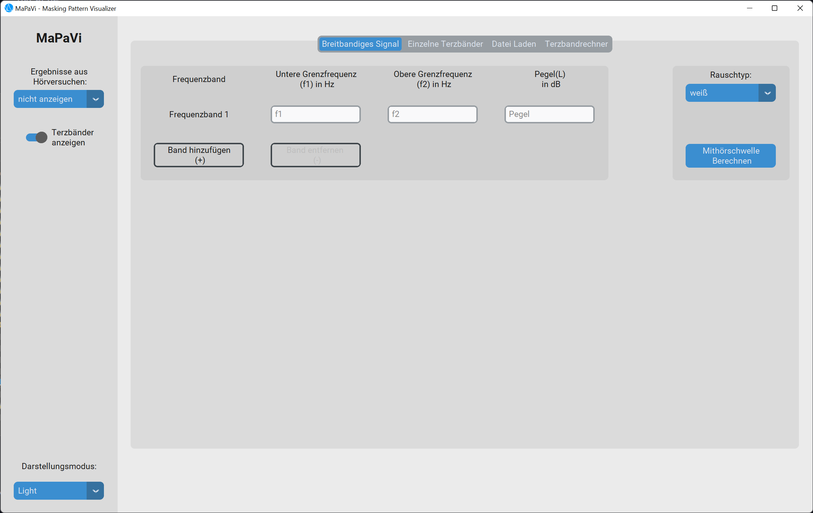

# MaPaVi - Masking Pattern Visualizer



## Purpose

Whether it's for developing effective data reduction methods or creating clean music mixes, psychoacoustic masking effects are highly significant across nearly all areas of sound engineering and audio. By analyzing auditory masking thresholds, it's possible to determine which data in an audio signal are imperceptible to the human ear and can be removed, or how loud a specific musical instrument can be set without excessively covering others in the mix. Masking effects also play a crucial role in everyday life. For example, they make it harder for us to understand someone speaking in a conversation at a busy intersection compared to a quiet room. The way certain background noises impair our hearing can be visualized through the representation of corresponding auditory masking threshold patterns.

This Software can be used to quickly and easily calculate and visualize such masking patterns for various interfering signals.


## Installation

1. Clone this Repository
```bash
git clone https://github.com/justinpallas/mapavi.git
```

2. Go to the cloned directory and install the dependencies
```bash
cd mapavi
pip install -r requirements.txt
```
3. You can now run the app using python
```bash
python app.py
```

>*Note:* If the GUI is not displayed correctly, it can be necessary to update Tkinter before running the app.
